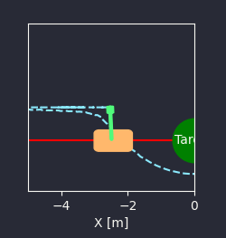
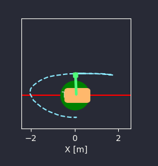

# Fault-Tolerant-Control

## Overview
This section provides a brief introduction to the project conducted as part of the Advanced Control Methods course at Skoltech in 2024. It includes the fundamental objectives of the project, information about the team members, and a link to the final presentation.

- Course: Advanced Control Methods, Skoltech, 2024
- Team Members: [Ilona Basset](https://github.com/ilo-bst), [Mikhail Mishustin](https://github.com/mishkaaa31), [Ruslan Gladilov](https://github.com/RuslanGladilov)
- Final Presentation: [link](https://docs.google.com/presentation/d/1OndUG2DB0yXjvMWQS30-TukYlxjxPwfYRwaH3VeM5bQ/edit#slide=id.p)

---

## Table of Contents

- [Overview](#overview)
- [Problem Statement](#problem-statement)
- [Results](#results)
- [Run the Project](#run-the-project)
- [Other Section](#other-section)
- [Bibliography](#bibliography)

---

## Problem Statement
This section delves into the specifics of the challenge tackled during the project.  It provides context, outlines the objectives, and discusses the significance of the problem.

This project aims to implement and evaluate fault-tolerant control strategies for dynamic systems. The goal is to ensure system reliability and robustness in the presence of faults.

### Subsection (if any)
Subsections may be added to further break down the problem, provide background information, or elaborate on specific aspects that are crucial to understanding the project's scope.

---

## Results
We added noise in different coordinates.
The result is the following:
The FTC works by adding noise to any coordinates. Conventional energy-based control from hw1 does not work if noise is added to any coordinate.

Without fault-tolerant control:



with using fault-tolerant control:



### Subsection (if any)
Subsections may be used to organize results into categories, discuss different algorithms or methods used, or compare various scenarios within the project.

---

## Run the Project
### Requirements
List of prerequisites, dependencies, and environment setup necessary to run the project.
- Regelum 0.3.2
- Numpy 1.26.4
- Scipy 1.13.0


### Setup and Installation
Before installing the requirements, it is recommended to [create a virtual environment](https://github.com/OdinManiac/acm-2024-sem-1) for your project. And then run
```bash
git clone https://github.com/ilo-bst/Fault-Tolerant-Control.git
cd Fault-Tolerant-Control
pip install -r requirements.txt
code .
```


### Running the Code
To run fault-tolerant control:
```bash
python run.py policy=cartpole_fault initial_conditions=cartpole_swingup system=cartpole_fault --interactive --fps=3
```

To run basic control:
```bash
python run.py policy=cartpole_energy_based initial_conditions=cartpole_swingup system=cartpole_fault --interactive --fps=3
```
> **Note:**
>
> For the `--fps` parameter, you can select any suitable value to ensure a smooth experience (e.g., `--fps=2`, `--fps=10`, `--fps=20`, etc.).


## Bibliography/Links

- [CartPole](https://regelum.aidynamic.io/systems/cartpole/)
- [Fault-tolerant-control](https://gitflic.ru/project/aidynamicaction/classedu2024-advctrl/blob?file=lectures%2Flec-6%2FNotes_240416_184536.pdf&commit=67dd87ffbb6480eeee682b23db8588f1e584c7d8)
- [Instruction for creating virtual environment](https://github.com/OdinManiac/acm-2024-sem-1)


# Project Details
### Objectives
- Develop a fault-tolerant control system.
- Test the system under various fault conditions and noise levels.
- Evaluate the impact of additional control terms on system performance.
  
### Approach
- System Modeling: Define the system equations and control laws.
- Fault Detection: Implement methods to detect and isolate faults.
- Control Reconfiguration: Adjust control strategies to maintain performance despite faults.
- Parameter Tuning: Optimize hyperparameters for robustness.

### Current Status
- Basic control system implemented.
- Preliminary tests show that the additional term improve performance under noise. Cart does not go left as much as without that term. The angle stabilization works pretty good in both cases.

  
### Future Work
- Refine fault detection and isolation algorithms.
- Explore different control reconfiguration strategies.
- Test on a simpler system like Inverted Pendulum.
  
### Contributors
Ilona Basset,
Mikhail Mishustin,
Ruslan Gladilov
